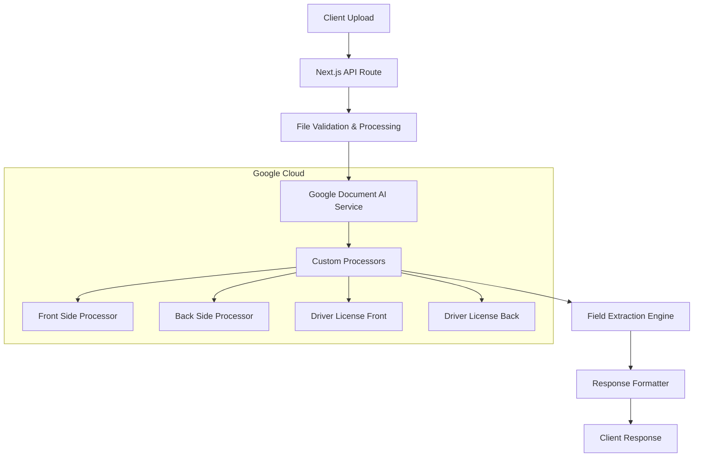

# Design Document

## Overview

The Moroccan ID OCR Pipeline is a comprehensive document processing system built on Next.js App Router architecture, leveraging Google Document AI for intelligent field extraction from Moroccan National ID cards (CIN) and Driver's Licenses. The system provides secure, scalable, and production-ready OCR capabilities with support for both front and back side processing using custom-trained processors.

## Architecture

### High-Level Architecture



### System Components

1. **Client Layer**: React components with file upload and result display
2. **API Layer**: Next.js App Router API routes for secure processing
3. **Service Layer**: Google Document AI integration and business logic
4. **Processing Layer**: Custom processors for different document types and sides
5. **Validation Layer**: Field validation and confidence scoring

## Components and Interfaces

### Core API Routes

#### `/api/ocr/process` - Main Processing Endpoint
```typescript
interface ProcessRequest {
  file: File;
  documentType: 'cin' | 'driver_license';
  side: 'front' | 'back';
}

interface ProcessResponse {
  success: boolean;
  data?: ExtractedFields;
  error?: string;
  confidence: number;
  processingTime: number;
}
```

#### `/api/ocr/config-test` - Configuration Testing
```typescript
interface ConfigTestResponse {
  success: boolean;
  processors: ProcessorStatus[];
  authentication: AuthStatus;
  recommendations: string[];
}
```

### Service Classes

#### `DocumentAIService`
```typescript
class DocumentAIService {
  private client: DocumentProcessorServiceClient;
  private processors: ProcessorConfig;
  
  async processDocument(file: Buffer, processorId: string): Promise<ProcessingResult>;
  async validateConfiguration(): Promise<ConfigValidation>;
  private extractFields(document: Document): ExtractedFields;
  private calculateConfidence(entities: Entity[]): number;
}
```

#### `FileProcessor`
```typescript
class FileProcessor {
  static validateFile(file: File): ValidationResult;
  static convertToBuffer(file: File): Promise<Buffer>;
  static optimizeImage(buffer: Buffer): Promise<Buffer>;
}
```

### Data Models

#### `ExtractedFields` Interface
```typescript
interface ExtractedFields {
  // Common fields
  documentType: 'cin' | 'driver_license';
  side: 'front' | 'back';
  
  // CIN Front fields
  fullName?: string;
  cinNumber?: string;
  dateOfBirth?: string;
  placeOfBirth?: string;
  photo?: boolean;
  
  // CIN Back fields
  address?: string;
  issueDate?: string;
  expiryDate?: string;
  authority?: string;
  
  // Driver License Front fields
  licenseNumber?: string;
  licenseCategories?: string[];
  
  // Driver License Back fields
  restrictions?: string[];
  
  // Metadata
  confidence: number;
  fieldConfidences: Record<string, number>;
  processingTime: number;
}
```

#### `ProcessorConfig` Interface
```typescript
interface ProcessorConfig {
  projectId: string;
  location: string;
  processors: {
    cinFront: string;
    cinBack: string;
    driverLicenseFront: string;
    driverLicenseBack: string;
  };
}
```

## Error Handling

### Error Classification System

```typescript
enum OCRErrorType {
  AUTHENTICATION_ERROR = 'AUTHENTICATION_ERROR',
  PROCESSOR_NOT_FOUND = 'PROCESSOR_NOT_FOUND',
  FILE_VALIDATION_ERROR = 'FILE_VALIDATION_ERROR',
  PROCESSING_TIMEOUT = 'PROCESSING_TIMEOUT',
  QUOTA_EXCEEDED = 'QUOTA_EXCEEDED',
  UNKNOWN_ERROR = 'UNKNOWN_ERROR'
}

interface OCRError {
  type: OCRErrorType;
  message: string;
  details?: any;
  retryable: boolean;
  suggestedAction?: string;
}
```

### Retry Strategy

```typescript
class RetryHandler {
  private maxRetries = 3;
  private baseDelay = 1000;
  
  async executeWithRetry<T>(
    operation: () => Promise<T>,
    errorType: OCRErrorType
  ): Promise<T> {
    // Exponential backoff implementation
    // Different retry strategies based on error type
  }
}
```

### Error Response Format

```typescript
interface ErrorResponse {
  success: false;
  error: {
    type: OCRErrorType;
    message: string;
    code: string;
    retryAfter?: number;
    suggestions: string[];
  };
}
```

## Testing Strategy

### Unit Testing

1. **Service Layer Tests**
   - Document AI client initialization
   - Field extraction logic
   - Error handling scenarios
   - Configuration validation

2. **Utility Function Tests**
   - File validation
   - Image processing
   - Field formatting
   - Confidence calculation

### Integration Testing

1. **API Route Tests**
   - File upload handling
   - Authentication flow
   - Response formatting
   - Error scenarios

2. **Google Document AI Integration**
   - Processor connectivity
   - Document processing flow
   - Field extraction accuracy
   - Performance benchmarks

### End-to-End Testing

1. **Document Processing Workflow**
   - Complete CIN front/back processing
   - Driver license processing
   - Multi-document batch processing
   - Error recovery scenarios

2. **Performance Testing**
   - Concurrent request handling
   - Memory usage optimization
   - Processing time benchmarks
   - Rate limit handling

### Test Data Strategy

```typescript
interface TestDocument {
  type: 'cin' | 'driver_license';
  side: 'front' | 'back';
  file: string; // path to test image
  expectedFields: Partial<ExtractedFields>;
  confidenceThreshold: number;
}
```

## Security Considerations

### Authentication & Authorization

1. **Service Account Security**
   - JSON key file stored outside web root
   - Environment variable configuration
   - Principle of least privilege for IAM roles

2. **API Security**
   - File type validation
   - File size limits (10MB max)
   - Rate limiting per IP/user
   - Input sanitization

### Data Privacy

1. **Document Handling**
   - No persistent storage of uploaded documents
   - Memory cleanup after processing
   - Secure transmission to Google Cloud

2. **Extracted Data**
   - Optional data encryption at rest
   - Audit logging for sensitive operations
   - Configurable data retention policies

### Environment Configuration

```typescript
interface SecurityConfig {
  maxFileSize: number; // 10MB
  allowedMimeTypes: string[];
  rateLimitPerMinute: number;
  enableAuditLogging: boolean;
  encryptExtractedData: boolean;
}
```

## Performance Optimization

### Caching Strategy

1. **Processor Configuration Caching**
   - Cache processor metadata for 1 hour
   - Reduce Google Cloud API calls
   - Faster configuration validation

2. **Result Caching** (Optional)
   - Cache results by file hash
   - Configurable TTL (default: disabled for privacy)
   - Memory-based cache for development

### Memory Management

1. **File Processing**
   - Stream-based file handling
   - Immediate buffer cleanup
   - Memory usage monitoring

2. **Concurrent Processing**
   - Queue-based processing for high load
   - Configurable concurrency limits
   - Graceful degradation under load

### Monitoring & Metrics

```typescript
interface ProcessingMetrics {
  totalRequests: number;
  successfulExtractions: number;
  averageProcessingTime: number;
  errorsByType: Record<OCRErrorType, number>;
  averageConfidenceScore: number;
}
```

## Configuration Management

### Environment Variables

```typescript
interface EnvironmentConfig {
  // Required
  GCP_PROJECT_ID: string;
  GCP_LOCATION: string;
  GCP_KEY_FILE: string;
  PROCESSOR_ID_FRONT: string;
  PROCESSOR_ID_BACK: string;
  PROCESSOR_ID_DRIVER_FRONT: string;
  PROCESSOR_ID_DRIVER_BACK: string;
  
  // Optional
  MAX_FILE_SIZE?: string; // default: "10MB"
  PROCESSING_TIMEOUT?: string; // default: "30000"
  ENABLE_DEBUG_LOGGING?: string; // default: "false"
  CACHE_TTL?: string; // default: "3600"
}
```

### Runtime Configuration

```typescript
class ConfigManager {
  static validateEnvironment(): ValidationResult;
  static getProcessorConfig(): ProcessorConfig;
  static getSecurityConfig(): SecurityConfig;
  static getPerformanceConfig(): PerformanceConfig;
}
```

## Deployment Considerations

### Production Checklist

1. **Environment Setup**
   - All required environment variables configured
   - Service account permissions verified
   - Processor IDs validated

2. **Performance Tuning**
   - Memory limits configured
   - Timeout values optimized
   - Rate limiting enabled

3. **Monitoring Setup**
   - Error logging configured
   - Performance metrics collection
   - Alert thresholds defined

### Scalability Planning

1. **Horizontal Scaling**
   - Stateless API design
   - Load balancer compatibility
   - Session-independent processing

2. **Resource Management**
   - CPU and memory requirements
   - Google Cloud quota management
   - Cost optimization strategies

This design provides a robust, secure, and scalable foundation for the Moroccan ID OCR Pipeline, leveraging existing project infrastructure while introducing comprehensive document processing capabilities.